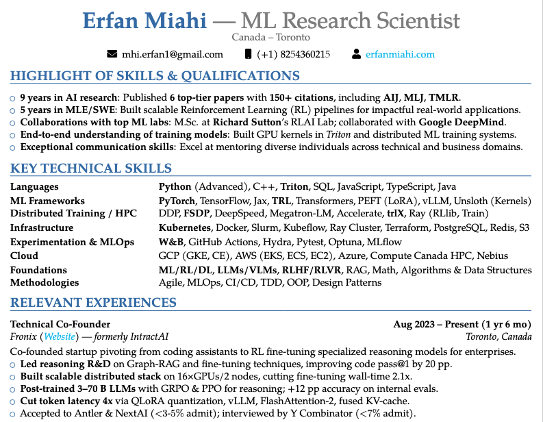

<div align="center">

# Elegant LaTeX Resume Template
### Professional CV template using `moderncv` banking style




</div>

## ✨ Features

- Clean and professional design
- Modular section organization
- Easy to customize
- FontAwesome 5 icons support
- Multi-language support
- ATS-friendly layout

## 🚀 Quick Start

1. Clone repository:
```bash
git clone https://github.com/yourusername/latex-resume.git
```

2. Update your information:
   - Edit files in `sections/` directory
   - Customize styling in `main.tex`

3. Generate PDF:
```bash
pdflatex main.tex
```

## 📦 Prerequisites

```bash
# TeX Live (Ubuntu/Debian)
sudo apt install texlive-full

# MiKTeX (Windows)
# Download from miktex.org
```

Required packages: `moderncv`, `fontawesome5`, `tabularx`, `geometry`, `multicol`

## 📁 Template Structure

```plaintext
resume/
├── main.tex                 # Main template file
├── sections/               # Modular content sections
│   ├── personal_data.tex    # Contact information
│   ├── education.tex        # Academic background
│   ├── experiences.tex      # Work experience
│   ├── skills_highlight.tex # Key competencies
│   ├── projects.tex         # Notable projects
│   ├── publications.tex     # Research papers
│   ├── awards.tex          # Achievements
│   ├── languages.tex       # Language proficiency
│   └── key_skills.tex      # Technical skills
└── assets/
    └── images/
        └── preview.png      # Template preview image
```

## 📝 License

This project is open source and available under the [MIT License](LICENSE).

---

<div align="center">
⭐ Star this repo if you find it helpful!

Need help? [Open an issue](https://github.com/yourusername/latex-resume/issues)
</div>